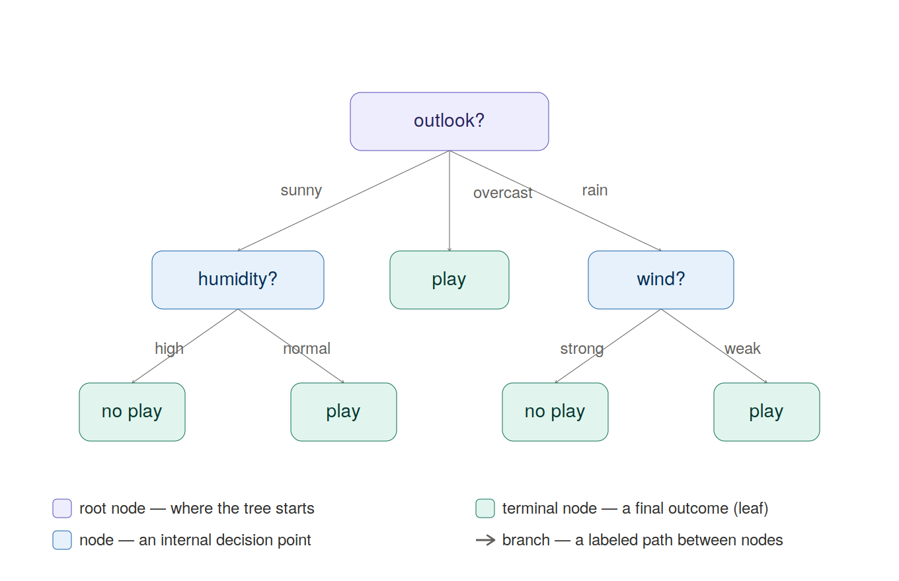

# Modeling Water Potability

```{r}
library(tidyverse)
library(ggplot2)
library(tidymodels)
library(gt)
library(ggpubr)
library(corrplot)
```

## Introduction:

Stated plainly, water is critical for the survival of humans. Specifically, access to clean drinking water is critical to our ability to survive and thrive. However, due to many factors, like climate change, fracking, and even AI data centers, access to clean water has become a mainstream concern, even in well-developed nations.

If access to water is limited in the future, this means we will have to make the most of the water we do have. Additionally, in communities where water supply and qualify is in question, it is critical that citizens have confidence that the water that they do have is safe to consume.

Water "potability", which is defined as water being safe to drink for humans, is the response variable that we will use for modeling. Our goal is to develop a model that predicts water potability with a high degree of certainty. We will use common attributes that can be measured from a sample of water as predictor variables.

## Why create a predictive model for water potability?

There are many reasons why a predictive model for water potability could be helpful:

1.  Understanding of what makes water potable: Some predictive and statistical models can give an indicator of variable importance in the context of predicting water potability. If there are variables that impact water potability more than others, we can focus of what specifically about those variables causes water to be potable / not potable, then propose some corrective actions to ensure the high-risk variables are controlled in at risk environments

2.  Access: Not everyone has access to the expertise, process, or equipment needed to determine if water is potable. A predictive model could help us target sub-populations that could be at risk of having non-potable water based on the geography and other attributes that are easier to measure. Additionally, at-home kits to measure the predictor attributes like pH and sulfates are relatively accessible, meaning that anyone could use our predictive model to determine if their water is potable

## Modeling Approach:

In this document, the entire process of data pre-processing, model training, model evaluation, and final model selection will be outlined. A few parameters will be set and shared across all candidate models:

-   At 70/30 train/test split will be used to train and evaluate the models

-   5 Fold Cross-Validation will be used to tune the models and evaluate model performance before using the test set to chose the best overall model.

-   The same starting data set and predictors will be used across all models.

-   Log-Loss will be used as the model evaluation metric. Using log-loss is appropriate for predicting water potability, as we would like to prioritize models that predict with a high degree of certainty. Using accuracy misses out on this nuance, as water sample that we are 51% certain is potable and a water sample we are 99% certain is potable are evaluated the same under the accuracy metric.

-   As mentioned in the EDA report, we will drop observations that contain missing values for modeling. This can be revisited in the future as we key in on variables that are most critical for predicting water potability. For now, we will include all predictors in each model.

The following models will be evaluated in this report:

-   Classification Tree

-   Random Forest

## Data Pre-Processing:

We will take the same approach to cleaning data that was taken in the EDA report, in addition other pre-processing steps to ensure for the best modeling:

1.  Read in data
2.  Drop observations with missing data
3.  Cast the "potability" response variable as a factor
4.  Standardize all numeric predictors

We will use the `tidymodels` framework for data processing and modeling. Here, we will create the data pre-processing *recipe*.

First we will read in data and keep variable names consistent with the EDA report:

```{r}

potabilityDf = read.csv("water_potability.csv",
                        col.names = c("ph",
                                      "hardness",
                                      "solids",
                                      "chloramines",
                                      "sulfate",
                                      "conductivity",
                                      "organicCarbon",
                                      "thm",
                                      "tubidity",
                                      "potability"
                                      
                                      
                                      ))


head(potabilityDf)

```

Next, we will create a pre-processing recipe that will be used for each candidate model

```{r}

## Note - have to convert potability to a factor outside of the recipe. This is because when we predict, we don't have access to the response, so any transformatiions to the response have to happen outside of the recipe

potabilityDf = potabilityDf |> mutate(potability = as.factor(ifelse(potability == 0, FALSE, TRUE)))

preProcessingRecipe = recipe(potability ~ ., data = potabilityDf) |>
  step_naomit() |>
  step_normalize(all_numeric_predictors())
  
```

## Generation of Train / Test Split

We will use a 70/30 train/test split. We will also create 5 folds on the training set for cross-validation.

```{r}
potabilitySplit = initial_split(potabilityDf, prop = .7)
potabilityTrain = training(potabilitySplit)
potabilityTest = testing(potabilitySplit)
potabilityFolds <- vfold_cv(potabilityTrain, 5)

```

## Modeling:

### Classification Tree:

#### What is a Classification Tree?

A classification tree is a non-parametric predictive model whose goal is to split the data into regions or "nodes" where the data is most homogeneous. In the case of a classification model, the model is trained to optimize the proportion of observations with the same class in a single node.

For multiple predictors, the same "splitting" process is done, except for the evaluation is done for each predictor variable, and the best overall split is chosen across all predictor variables.

This process is repeated until a certain stopping criteria is met (maximum number of splits OR minimum number of observations within a node), and what we are left with is a structure that looks like a tree, with many splits or "branches" consisting of many nodes.

In the classification setting, we make our prediction by taking an observation and following the splits set by the tree model until we are left at the final or "terminal" node. The classification is made by predicting the most prevalent class within the terminal node. Refer to the diagram below for an example of a classification tree.



#### How to tune a classification tree

Tree-based models can be tuned with two different methods. These methods are called **stopping criteria** and **pruning**

Stopping Criteria refers to the the decision of when to stop splitting the tree model. We can specify this in two ways, maximum tree depth, and minimum observations in a node. Maximum tree depth refers to the total number of splits allowed. Minimum observations in a node means that we stop splitting the tree when the node reaches a lower limit of observations in it. Normally, one of the two stopping criteria are selected to train a tree model.

Pruning refers to the process of training a full tree model using one of the stopping criteria mentioned above, then selectively removing or "pruning" nodes away in an attempt to simplify the tree. When we do tree pruning, we chose a tuning parameter called the "cost complexity" which is a penalty term applied to the number of nodes in the tree. The penalty applied to the number of nodes balances the complexity of the tree, and the tree's ability to make very certain predictions, which can prevent over fitting.

### Implementing the Classification Tree

We will create a workflow that leverages the pre-processing tree and trains the model on the regression tree. We will use 5-fold cross-validation to tune on the cost complexity parameter. We will set the minimum number of observations in a node to be 25.

```{r}

## Specify tree based model

treeModel = decision_tree(min_n = 25,
                          cost_complexity = tune()) |>
  set_engine("rpart") |>
  set_mode("classification")

## Set workfow

treeWorkflow = workflow() |>
  add_recipe(preProcessingRecipe) |>
  add_model(treeModel)

```

### Fit Model on Cross-Validation

```{r}
## Create tune grid, with 100 values of cost complexity
tuneGrid <- grid_regular(cost_complexity(),
                          levels = c(100))

## Train Models with Cross-Validation

treeFitCV = treeWorkflow |>
  tune_grid(resamples = potabilityFolds,
            metrics = metric_set(mn_log_loss),
            grid = tuneGrid)


```

The results of this fit are 5 model fits for each of the 100 values of the cost complexity tuning parameter. We can run `collect_metrics()` to average the log-loss for all 5 CV fits across each value of tuning parameter. From there, we can chose the value of cost complexity that yields the best model.

```{r}
cvMetrics = treeFitCV |> collect_metrics()

head(cvMetrics)

```

Let's plot the log-loss at each level of cost complexity to see how the model performs as cost complexity changes:

```{r}
g = ggplot(data = cvMetrics, aes(x = cost_complexity, y = mean)) 


g + geom_line() + labs(x = "Cost Complexity", y = "Log-Loss")
```

The models seems to to the best when cost complexity is set to around 0.025. Let's see what the actual best fit is.

```{r}

bestTree = select_best(treeFitCV, metric = "mn_log_loss")

bestTree
```

We were right! The best tree happened with a cost complexity of 0.0284. Let's save this model for future reference to test on the test set:

```{r}

treeFinalWorkflow = treeWorkflow |> finalize_workflow(bestTree)
```

Next we will repeat for the Random Forest Model.

### Random Forest Model

#### What is a Random Forest Model?

On a high level, a random forest model is very similar to a regression tree, but it has two main differences, which we will explain in more detail:

-   Random forest models are an "ensemble model", which means that predictions / classifications come from the mean / majority vote from many models. In a random forest model, this is done with what is called a "bagged tree"

-   Random forest models are trained very similar to tree-based models, except for they add an element of randomness, hence the name. The randomness comes from a random selection of predictors that are included at each split of the tree. The random selection will prevent any few variables from overpowering the model, which should help the model generalize to new data.

We will discuss both of these concepts to build an understanding of the random forest model

#### Ensemble and Bagged Tree Models:

As mentioned above, an "ensemble" model is one that used many different child models to make a prediction / classification. However, if we are using the same model and training for each child model, we aren't really getting anywhere, as each fit will be the same. We will not be enjoying the generalization that ensemble models claim to bring! So, we need a way to introduce some variability somehow to train each child model differently to create some diversity in model predictions. We do this with a process called "bagging", short for bootstrap aggregation. We follow this process to train and evaluate predictive models with bagging:

1.  Take "B" bootstrap samples (sample with size *n*, with replacement)
2.  For each of the "B" bootstrap samples:
    1.  Train a tree model
    2.  Use the samples from the test set that we did not select ("out-of-bag" samples) as a mini-test set to generate a model metric
3.  To make predictions / classifications, generate a prediction on each of the "B" bootstrap samples and use the mean / majority vote to predict / classify the response
4.  To evaluate the bagged tree against other candidate model, use the average of the "B" model metrics as our bagged tree model metric

#### Introducing Randomness into the Bagged Tree Model:

In the description of the bagged tree, we explored the idea of wanting some variation in each of the child models. This is a bit of a counterintuitive idea, because some child models will perform quite well on the training set and others may not, but all count the same towards the final prediction. However, we want this model to generalize well to data it hasn't seen before, so introducing some randomness into the model training should help us generalize to new data, since the new data might be pretty different than our training set. If we introduce some randomness along the way, we have a better chance of generalizing well.

The same idea extends to the random forest model. A random forest model is a special case of a bagged tree, but we add another element of randomness by selecting a random subset of predictors to use at each split. Recall from the description of the regression tree, at each split we look for the optimal split. across all predictors. In the random forest model we limit ourselves to a random selection of predictors. In the same way that the bagged tree uses the bootstrap in an attempt to generalize well to unseen data, the random forest model does the same with the restricted selection of predictors at each step. The number of parameters to select at each step is a tuning parameter that we can use to select the optimal random forest model.

### How to Tune a Random Forest:

The random forest model is an extension of a tree-based models, so the same tuning parameters, maximum tree depth, minimum observations in a terminal node, and cost complexity for pruning, are still in play. The random forest introduces two additional tuning parameters:

-   Number of Trees to Fit: This is controlling how many bootstrap samples to take

-   Number of Predictors at Each Split: We can chose a number of predictors to randomly select at each split that is less than or equal to the number of predictors in the training set

### Implementing the Random Forest Model:

We will create a similar workflow to the regression tree to tune an optimal random forest model. We will only tune on the number of parameters at each split. We have 9 predictors, so we will tune on random selection from 1-9 variables. Similar to the regression tree, we will allow the minimum observations in a terminal node for each tree to be 25.

```{r}

# specify random forest model:

rfModel = rand_forest(mtry = tune(), min_n = 25) |>
  set_engine("ranger") |>
  set_mode("classification")

## Create workflow use the same recipe as the regression tree

rfWorkflow = workflow() |>
  add_recipe(preProcessingRecipe) |>
  add_model(rfModel)
  

```

Now we will use cross-validation to determine how the model does at each level of `mtry` which is the number of predictors to randomly include at each step

```{r}
rfFit = rfWorkflow |>
  tune_grid(resamples = potabilityFolds,
            grid = 9,
            metrics = metric_set(mn_log_loss))
```

```{r}

rfMetrics = rfFit |> collect_metrics()

head(rfMetrics)


```

Let's see how the model performs at different values of "mtry"

```{r}
g = ggplot(data = rfMetrics, aes(x = mtry, y = mean)) 


g + geom_line() + labs(x = "Number of Random Predictors", y = "Log-Loss")
```

It looks like the model did the best with 7 predictors. Let's verify

```{r}

bestRf = select_best(rfFit, metric = "mn_log_loss")

bestRf
```

We are correct again! Now let's use this best tree model to get a final model

```{r}

rfFinalWorkflow = rfWorkflow |> finalize_workflow(bestRf)
```

## Final Model Evaluation

Now that we have tuned both the regression tree and random forest, we will evaluate both models on the test set to declare a best model:

```{r}

treeFinalFit = treeFinalWorkflow |> last_fit(potabilitySplit, 
                                             metrics = metric_set(mn_log_loss)) |> collect_metrics()

rfFinalFit = rfFinalWorkflow |> last_fit(potabilitySplit, 
                                             metrics = metric_set(mn_log_loss)) |> collect_metrics()


comps = rbind(treeFinalFit, rfFinalFit) |> mutate(type = NA)

comps$type[1] = "Regression Tree"
comps$type[2] = "Random Forest"

comps |> select(type, .metric, .estimate)
```

The random forest model performed best! That is our best model!

## Fit the Random Forest Model on the Entire Data Set and Make a Prediction

```{r}

finalFit = rfFinalWorkflow |> fit(potabilityDf)

newData = potabilityDf[4, ]

predict(finalFit, new_data = newData)
```
